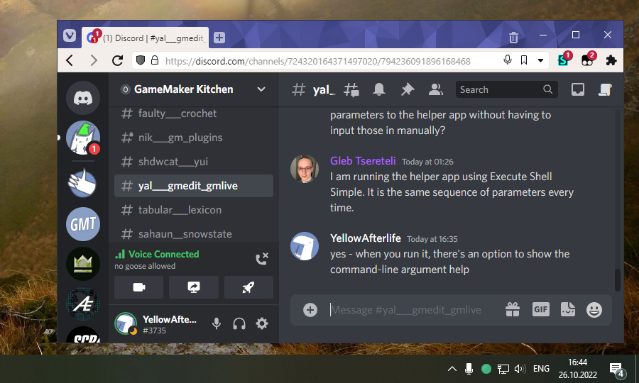

# Tray Icon For Discord Web

Web version of Discord is quite convenient - such as
for [security](https://yal.cc/discord-2021/),
or being able to apply custom colors without modifying your client installation (which is also a security risk),
or even just being able to use Discord through a VPN if you're having RTC connection issues.

There are of course, a couple caveats - like not being able to set system-wide hotkeys (only browser extensions can do that), or not having a status icon in system tray (neither pages nor extensions can do that).

The latter is a bit of an inconvenience, but there are workarounds.

## How does it work

The tool consists of two parts:

- A .NET application that creates/updates the tray icon and listens for icon change requests over HTTP.
- A userscript that figures out the current Discord client state (deafened > muted > talking > connected > default) and informs the above application when it changes.

Discord permits requests to a local web server as some features (like desktop client "intercepting" invite links opened in a browser) work this way.

## Building

Open the included Visual Studio solution, compile (architecture doesn't matter).  
The project targets .NET framework 4.5, but you should be able to change it to any of later versions without any issues.

## Installing

Install the [included userscript](TrayIconForDiscordWeb.user.js) using GreaseMonkey or TamperMonkey.  
Refresh the Discord web client if it's open.

Extract the pre-built binary somewhere or compile it yourself (see above).

## Using

Run the application; open the Discord web client as usual.

If everything was set up correctly, the tray icon should update accordingly.

You can double-click the tray icon to close the application.

You can replace icons with your own in the `Icons` directory.

## Legality

In dry legal ToS language,
the userscript is less of a "modification to client software"
than use of an ad blocker - with no visual nor functional changes to the page, its presence cannot be easily observed.

But still, you know, use at your own risk without any warranty and so on and so forth.

## Known issues

- Closing the Discord tab will continue showing the "last known" tray icon.
- Works a little strangely with multiple Discord tabs open  
  (since events are independent for each of them)

## Mac/Linux

You can use the same approach to create a cross-platform application like this, though I urge you to resist using Electron for it.

## Meta

Tool by [YellowAfterlife](https://yal.cc).  
Discord materials are copyright of Discord inc.